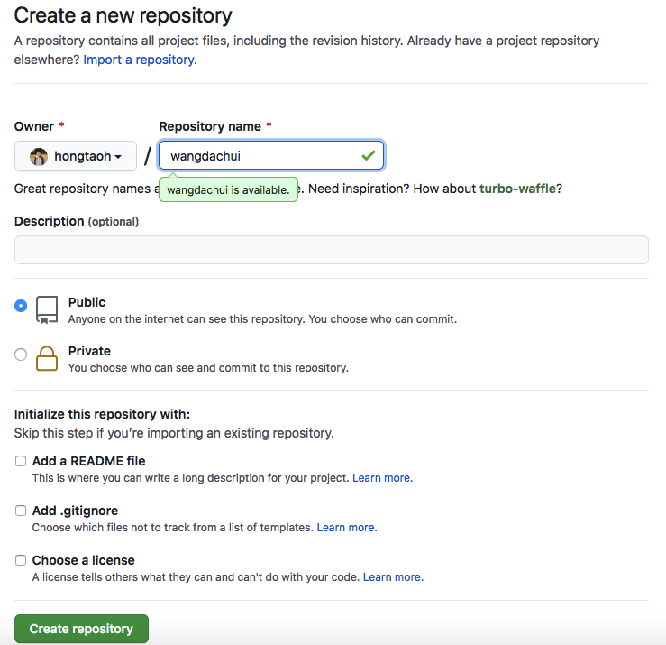
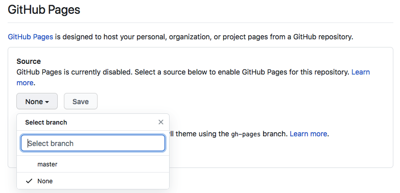
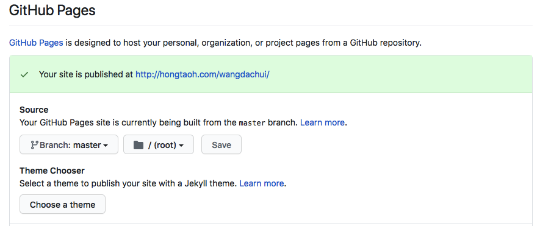

# HTML 基本知识{#html-basics}

如果使用 Typora 完成的之前布置的Markdown 的作业，答案请参考[这里](static/files/wangdachui.md)。请检查下是否和你的答案一致。

用 Typora 打开这份 Markdown 文档后，选择 文件 (File) $\to$ 导出 (Export) $\to$ HTML (without styles). 导出后的 `HTML` 文档应该是[这样](static/files/wangdachui.html)。

用浏览器打开这份 HTML 文档，你可以看到和你在 [2.3 Markdown 练习中](markdown.html#md-exercise) 看到的结果一致。你现在看到的就是一个最基本的网页了。

## 网页部署{#deploy-html}

在讲解 HTML 只是之前，我们先把刚才的网页放到网上。别人能看到的网页才是真正的网页。

第一步，在你的电脑上创建一个文件夹，将其命名为 wangdachui。然后把刚才导出的 HTML 文件重新命名为 `index.html` 并放到 wangdachui 这个文件夹。

第二步，请确保你已经有了一个 [GitHub](https://github.com/) 账号。登陆之后，在屏幕右上角你的 GitHub 头像左侧有一个 $+$ 的标志。点击它，然后选择 New repository。在出现的页面中，在 Repository name 那里填上 wangdachui 或者任何你觉得合适的名字。其它都不要动，然后点击 Create repository。在随后出现的页面中，在 "Quick setup — if you've done this kind of thing before" 下面那一行，HTTP/SSH 后面有个网址，应该是 https://github.com/hongtaoh/wangdachui.git 这样的形式。把这个网址复制下来。

```{r new-repo, echo=FALSE, fig.cap="登陆 GitHub 之后，选择 New repository", fig.align='center', out.width = "50%"}
knitr::include_graphics('https://hongtaoh.com/media/netlify/deploy-1.png')
```

```{r new-repo-new, echo=FALSE, fig.cap="新建仓库设置", fig.align='center', out.width = "80%"}

```

```{r new-repo-url, echo=FALSE, fig.cap="新建仓库 URL", fig.align='center', out.width = "100%"}
knitr::include_graphics('static/img/new-repo-url.png')
```

第三步，打开你电脑上的终端。苹果电脑请打开 Terminal, 如果你连 Terminal 怎么打开都不知道，请看[这里](https://hongtaoh.com/cn/2020/01/04/hugo-netlify-deploy/#%E4%B8%89terminal-%E5%8F%8A-git-%E7%9F%A5%E8%AF%86%E9%A2%84%E5%A4%87)。使用Windows 系统的同学，打开你选择的[终端工具](prep.html#terminal)。

打开终端之后：

- 如果你是第一次使用 git, 你可能需要设置一些内容。在终端输入 `git config --global user.name "你的git用户名"`, 以及 `git config --global user.email "你的邮箱"`。用你的 GitHub 用户名和与 GitHub 绑定的邮箱应该就可以。不懂的话，请参考 [这里](https://git-scm.com/book/zh/v2/%E8%B5%B7%E6%AD%A5-%E5%88%9D%E6%AC%A1%E8%BF%90%E8%A1%8C-Git-%E5%89%8D%E7%9A%84%E9%85%8D%E7%BD%AE) 或 [这里](https://git-scm.com/book/zh/v2/%E8%B5%B7%E6%AD%A5-%E5%88%9D%E6%AC%A1%E8%BF%90%E8%A1%8C-Git-%E5%89%8D%E7%9A%84%E9%85%8D%E7%BD%AE)。

- 使用苹果电脑的同学，我建议你把 `wangdachui` 这个文件夹拖到桌面上，然后在 Terminal 中输入：

   ```{bash eval=FALSE}
   cd Desktop/wangdachui
   ```

- 使用 Windowns 系统的同学，如果你选择使用 PowerShell, 请先阅读 [这里](https://git-scm.com/book/zh/v2/%E9%99%84%E5%BD%95-A%3A-%E5%9C%A8%E5%85%B6%E5%AE%83%E7%8E%AF%E5%A2%83%E4%B8%AD%E4%BD%BF%E7%94%A8-Git-Git-%E5%9C%A8-PowerShell-%E4%B8%AD%E4%BD%BF%E7%94%A8-Git)。PowerShell 配备了 Git 之后，终端才能执行以下的代码。

- 使用 Windowns 系统的同学，打开了 [Cmder](https://cmder.net/) 或其它终端后，加入你把 `wangdachui` 这个文件夹在你的 `H` 盘，那么，请在 [Cmder](https://cmder.net/) 或其它终端中输入：

   ```{bash eval=FALSE}
   cd H:\wangdachui
   ```
   
如果你不确定路径是什么，输完 `cd` 之后，按一下空格，然后直接把 `wangdachui` 这个文件夹拖到终端中，路径会自动显示出来。

`cd` 是英文 change directory 的缩写。change directory 的意思是「改变路径」，也就是告诉终端之后我们要输入的代码要作用于哪一个项目。

现在，请拿出刚才你复制的类似 https://github.com/hongtaoh/wangdachui.git 的网址链接，我们接下来要用到。如果你的仓库名也是 `wangdachui` 的话，那么 https://github.com/hongtaoh/wangdachui.git 这个链接中你只需要把我的 GitHub 用户名 `hongtaoh` 换成你的就行。

随后，不管你的电脑是什么系统，请在你的终端中输入：

```{bash eval=FALSE}
git init
git add .
git commit -m "my first commit."
git remote add origin https://github.com/hongtaoh/wangdachui.git
# 请注意，https://github.com/hongtaoh/wangdachui.git 一定要替换为你自己的链接！！！
git push -u origin master
```

这个代码块你直接复制粘贴就行。粘贴完之后，别忘记按一下回车键。

上面几行代码需要注意的是：

1. `git init` 是创建一个 git 项目。`init` 应该是 initiate 的缩写。

2. `git add .`: 最后的那个点请不要忘记。那个点和 add
之间的空格也不要落下。这行代码是告诉 git，刚才新加的全部内容都要上传。

3. `git commit -m "my first commit."` 是为这次上传添加备注。一个 git 项目我们可能要上传很多次，每次上传不同的内容。给每次上传添加备注可以让我们之后了解每次上传的内容是什么。

4. **第四行代码一定要替换为你自己的链接！！！！！！**

上面的代码运行结束后，刷新你的 GitHub 页面，不出意外的化，你会看到 `index.html` 已经躺在你刚创建的仓库里了。

```{r new-repo-index, echo=FALSE, fig.cap="index.html 上传成功的页面", fig.align='center', out.width = "100%"}
knitr::include_graphics('static/img/new-repo-index.png')
```

现在，请点击上面那个图片中的 Settings。进入 Settings 页面后，一直往下拖，到你看到 GitHub Pages 为止。在 Source 下面，点击那个 None, 选择 master, 在 master 右侧那里选择 /(root), 然后点击 Save, 你应该能看到 "Your site is ready to be published at http://你的用户名.github.io/wangdachui/"。稍微等一分钟，刷新网页，当这行字变为绿底，内容变为 "Your site is published at ..." 时，点击那个网址，不出意外的话，你应该就能看到我们刚才那个网页内容了。现在，这个网页别人也能看到了。

```{r new-repo-gh-pages-01, echo=FALSE, fig.cap="点击 None, 选择 master", fig.align='center', out.width = "90%"}

```

```{r new-repo-gh-pages-02, echo=FALSE, fig.cap="部署成功后的页面", fig.align='center', out.width = "100%"}

```

## 内容更新{#gh-pages-updating}
